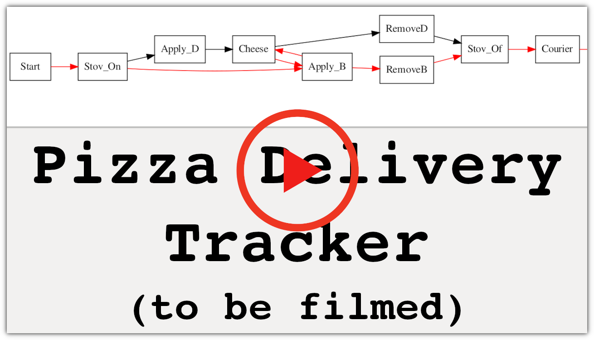

# Critical Path Management for Pizza Delivery Tracking [Unfinished]
---
This project takes a customer's order and generates an ordered list of when each ingredient will be assembled. Best of all, the program estimates the delivery time based on the longest path of steps from start to finish, called the critical path. To make things clearer, a pizza parlor robot was built to actually make and deliver customers' orders, as seen in the video below.

## Motivation
I realized C++ was a language I needed to hone as a roboticist, so I left Python on the back burner (pun absolutely intended) to put my data structure and algorithm skills to the test. I also wanted to make something related to food automation, which is my hobby per my [LEGO Vending Machines on YouTube](youtube.com/astonishingstudios), and critical path management was the best concept to unite my software skills and pastime.

## Video Demonstration
---

---
## Getting Started
---
### Requirements
The code files require:
1. [Python 3](https://www.python.org/downloads/)
2. [graphviz](https://graphviz.org/download/)
3. [G++](https://linuxconfig.org/how-to-install-g-the-c-compiler-on-ubuntu-18-04-bionic-beaver-linux)
4. More requirements to be added (WIP)

Before trying the required software and libraries, run the following from terminal:

`$ sudo apt update`

`$ sudo apt upgrade`
#### 1) Python
`$ sudo apt install python3.6`
#### 2) Graphviz
`$ sudo apt install graphviz`
#### 3) G++
`$ sudo apt install g++`

## How to Run the Code
---
In the terminal, navigate to the folder where you downloaded this repository's files. Compile the critical path management file by running `$ g++ cpm_pizza.cpp`. Then run the file by running `./a.out`. If you want to compile your code while naming your executable file something other than `a.out`, run `$ g++ cpm_pizza.cpp -o custom_name_here.exe` and then run `$ ./custom_name_here.exe`.

When prompted with `How many items will you be ordering today?`, one enters the quantity of items they would like. If `0` is entered, the program will prompt the question again, and again, until a positive number is entered.

For each dish, the follow prompt appears: `$ Dish #[Number_Here] - Enter (0) for Pizza, (1) for Calzone, (2) for Grilled Cheese :`. Clearly, one enters any of the three numbers to select that item, and entering the same number for the next time the prompt appears (in cases where the customer orders at least 2 items) is allowed.

From here, the results table, critical path and visual chart are generated, and the robot begins preparing the customer's order.

## Future Possibilities
---
Increasing the number of items on the menu, namely ones that overlap in their ingredients (ex: a rigatoni salad and a cheesy pasta), would create more intricate critical path charts. Consequently, the  ability of critical path management to highlight the longest path amid a mess of nodes and edges could be more deeply appreciated.

## References
