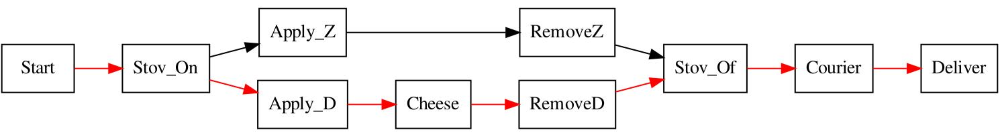
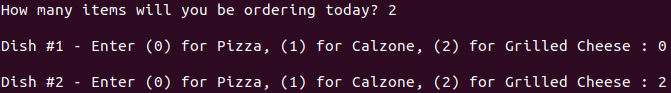
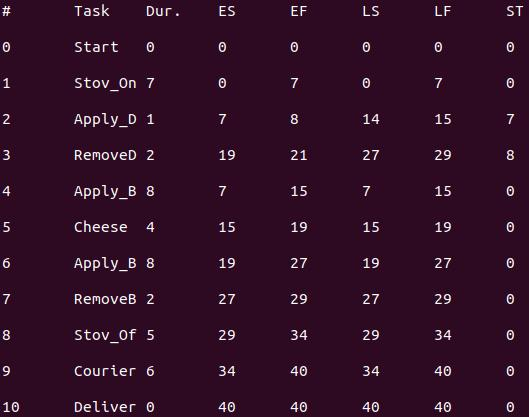
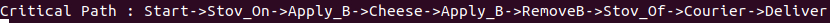
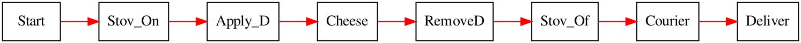
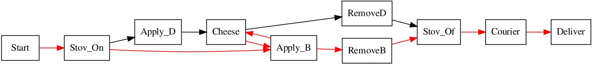

# Critical Path Management for Pizza Delivery Tracking

This project takes a customer's order and generates an ordered list of when each ingredient will be assembled. Best of all, the program estimates the delivery time based on the longest path of steps from start to finish, called the critical path.

## Motivation
I realized C++ was a language I needed to hone as a roboticist, so I left Python on the back burner (pun absolutely intended) to put my data structure and algorithm skills to the test. I also wanted to make something related to food automation, which is my hobby per my [LEGO vending machines on YouTube](youtube.com/astonishingstudios), and critical path management was the best concept to unite my software skills and pastime.

## Getting Started
### Requirements
The code files require:
1. [Python 3](https://www.python.org/downloads/)
2. [graphviz](https://graphviz.org/download/)
3. [G++](https://linuxconfig.org/how-to-install-g-the-c-compiler-on-ubuntu-18-04-bionic-beaver-linux)

Before trying the required software and libraries, run the following from terminal:

`$ sudo apt update`

`$ sudo apt upgrade`
#### 1) Python
`$ sudo apt install python3.6`
#### 2) Graphviz
`$ sudo apt install graphviz`
#### 3) G++
`$ sudo apt install g++`

## How to Run the Code
In the terminal, navigate to the folder where you downloaded this repository's files. Compile the critical path management file by running:

`$ g++ cpm_pizza.cpp`

Then run the file by running:

`./a.out`

If you want to compile your code while naming your executable file something other than `a.out`, run:

`$ g++ cpm_pizza.cpp -o custom_name_here.exe`

Then, run:

`$ ./custom_name_here.exe`

When prompted with `How many items will you be ordering today?`, one enters the quantity of items they would like. If `0` is entered, the program will prompt the question again, and again, until a positive number is entered.

For each dish, the follow prompt appears:

`$ Dish #[Number_Here] - Enter (0) for Pizza, (1) for Calzone, (2) for Grilled Cheese :`

Clearly, one enters any of the three numbers to select that item, and entering the same number for the next time the prompt appears (in cases where the customer orders at least 2 items) is allowed.

From here, the **results table**, **critical path** and **Activity-On-Node diagram** are generated, and the robot begins preparing the customer's order.

## Understanding the Outputs
### Table
This neatly details the duration of each state, and more importantly, when each one can start and end without disrupting the delivery time.

#### Early Start (ES)
The soonest time a task can begin, with all predecessors and successors considered. For example, turning off the stove can only begin once the item that takes longest to make is removed, otherwise that item will not be cooked long enough.
#### Early Finish (EF)
The soonest time a task can end, with all predecessors and successors considered. This is directly influenced by the early start time, but offset by the task's duration: ES + duration = EF.
#### Late Start (LS)
The latest time a task can start, with all predecessors and successors considered. For example, if 2 dissimilar items are ordered, the late start time for removing the quicker dish will always differ than the early start time for removing it. Because the stove is on for exactly as long as the item that is slower to cook needs, there is wiggle room for when the other dish needs to be removed, causing different early & late start times.
#### Late Finish (LF)
The latest time a task can end, with all predecessors and successors considered. This is directly influenced by the late start time, but offset by the task's duration: LS + duration = LF.
#### Slack Time (ST)
How long a task can be postponed before it affects the delivery time. This is the time difference between the late and early start times of a task.

### Critical Path
Simply put, this is the longest path from start to finish/delivery, meaning it is critical that there are no delays here or else it will single-handedly postpone the delivery. In this program, the generated path will consist of the first 2 nodes (Start & Stove On), the last 3 nodes (Stove Off, Courier & Deliver), and exactly all the ingredient nodes to make 1 of the ordered items. If at least 2 of the items ordered are the same, the critical path shows making that item 2+ times in a row (due to limited stove space), in addition to the 2 starting nodes and 3 ending nodes.

### Activity-On-Node Diagram
Similar to a flow chart, this reveals every path and each step that leads to the end result. However, even though the critical path is emphasized in red, every task determines the critical path and is executed. The diagram for ordering a pizza and a calzone is easy to interpret: the tasks `Apply_D`, `Cheese` and `RemoveD` (which represent adding a pizza dough disk, applying cheese and removing the resulting white/sauceless pizza) altogether take longer to run than `Apply_Z` with `RemoveZ` (which represents adding a calzone to the stove and removing it). Consequently, the critical path adds the 3 tasks to its path, right between turning the stove on and off.

If the unique number of items ordered is 1, then all tasks are part of the critical path and all nodes form a single line.

Conversely, ordering a pizza and grilled cheese sandwich reveals a complicated diagram. Thankfully, the critical path message from the terminal obviates what is happening. The cooking process starts (`Start`) and the stove is turned on (`Stov_On`), as always. Next, a slice of bread is put on the stove (`Apply_B`), and it is topped with cheese (`Cheese`). Because both the sandwich and pizza use the same ingredient, the robot in the above video uses a mechanism to sprinkle cheese simultaneously over the dough and bread. Then the `Apply_B` node is revisited, for another piece of bread goes atop the cheese using the same bread mechanism as before. Last, the sandwich is removed (`RemoveB`) and the typical tasks of turning the stove off (`Stov_Of`), giving the food to a delivery person (`Courier`) and delivering the food (`Deliver`) follow suit.

### A Closer Look at Topological Sorting
Topological sorting is an algorithm that takes nodes and their adjacent nodes as inputs, and is primarily used to output a linearly ordered stack where each node appears before its successors. This is the first time in the program a 1D vector holds all the nodes in temporal order, marking the first step in making a graph with directed edges (arrows pointing from one node to another).

The algorithm begins by creating a boolean vector, named `visit`, where each node is represented as an index declared with a `false` value. The integer `0`, the vector, and a 2D vector listing all the adjacent (`adj`) nodes are passed into a topological sorting function.

First, the `visit` vector at index `0` is marked as `true`, so it is not accidentally revisited with recursion. Then a for loop traverses through every non-visited value at `adj[0]` to recursively run this function, this time with all the same parameters except for `0` replaced with `adj[0][i]`, being one of node 0's adjacent nodes. Once a sub-vector with no non-visited nodes is reached, it's added to the stack before the previously recursed node(s) is/are added to the stack.

For instance, the first sub-vector with no non-visited nodes to be reached will be the `adj` subvector holding the sub-nodes of `Deliver`, which will be empty since the final task cannot have successors.

The algorithm is also run on a 2D vector listing all the predecessor nodes, `pred`, instead of `adj`, and starts at index `pred.size()-1` instead of `0` since each index holds the numerical value of its predecessor(s). The stack from topologically sorting the `adj` vector is used to find the LS & LF times. Meanwhile, the `pred` stack helps determine the ES & EF times, yielding all the calculations needed to form the Activity-On-Node Diagram!
## Future Possibilities
Increasing the number of items on the menu, namely ones that overlap in their ingredients (ex: a rigatoni salad and a cheesy pasta), would create more intricate critical path charts. Consequently, the  ability of critical path management to highlight the longest path amid a mess of nodes and edges could be more deeply appreciated.
